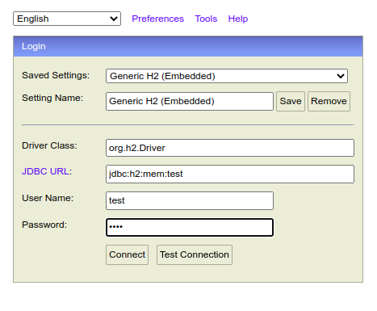
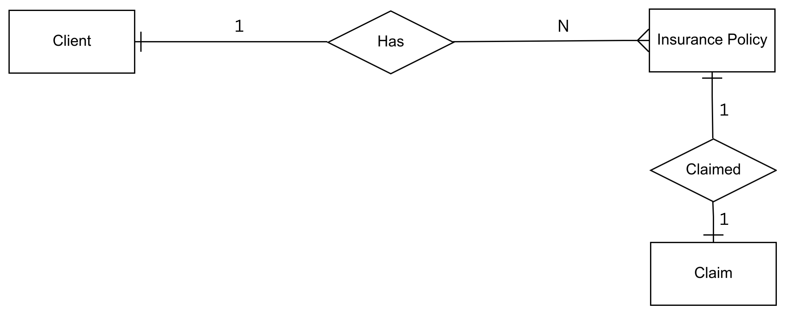

# Insurance management platform (Backend)

## Running the application in local

### Steps to run the application

- Note 1: These are the steps assuming you have Java 8 or greater installed in your machine.
- Note 2: Please connect to the internet before running the application to download its dependencies (dependencies will be downloaded automatically once you open the project in IDE)

   **Step 1**: Clone this repository and open the project in IDE(preferably in SpringToolSuite or IntelliJ).

   **Step 2**: Please wait until the IDE downloads all jars(dependencies).

   **Step 3**: Once the IDE downloads all the required jars, you can run the application using the green triangle "RUN" button provided by the
   Alternatively, you can also run the application by executing `ImtApplication.java` which contains `main()` function.

- Note: The default port on which Spring Boot Application runs is `8080`. Make sure the `8080` port is free and not being used by any other application.

   **Step 4**: Once the Application is running, go to `http://localhost:8080/h2-console/` and make sure your H2 configuration looks like below screenshot.

   Username: test
   Password: test

   

- Note: This application uses a in-memory database which is volatile, meaning it will reset everytime the application restarts.

## Architecture of the Application

### Description
- Client, Insurance Policy and Claim are called Entites.
- Each Client can have multiple Insurance Policies, therefore, the relationship is 1:N.
- Similarly, each Insurance Policy have only one Claim (meaning Policy can be claimed once) therefore, 1:1 relationship.
